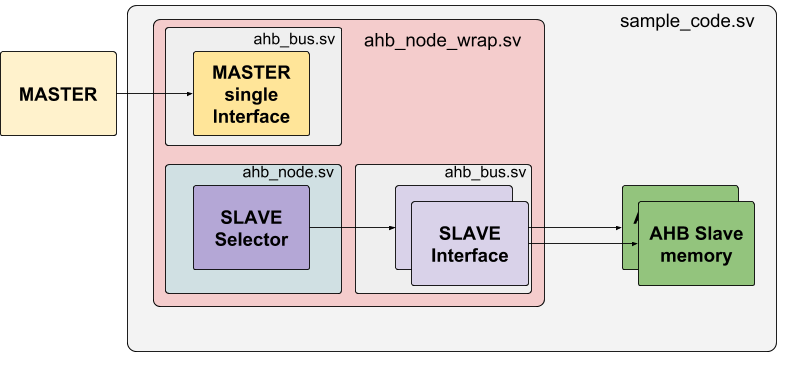

# AHBv3 Lite Bus multi-slave / single master 
------

This repository contains all resources to instantiate an AHB Bus Lite version 3 with a single master and multiple slaves. The slave selector of HSEL it's defined by a memory map with the start/end address of each slave in the bus. All the modules are able to pass parameters so you'll be able to change as your needs. The code it's organized as follows:
```bash
>rtl - Contains all files need to build your own AHB bus
> sample_code - Contains a demo of how to use the RTL to create a bus of slaves
```
